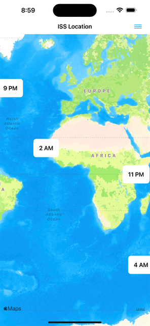
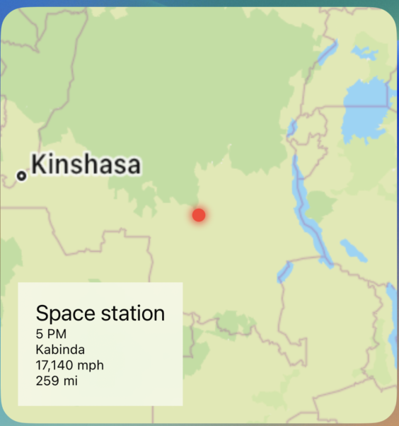

# Space Station Tracker

Example of a Widget and related project in SwiftUI.  Shows:
1. Extension and facading of a type with `@dynamicMemberLookup`
2. An implementation of `parallelMap` using `throwingTaskGroup`
3. Widgets at various sizes with `ViewThatFits`
4. `MKMapSnapshotter` to render map images since `MapView` is unavailable for Widgets

## App

## Widget

